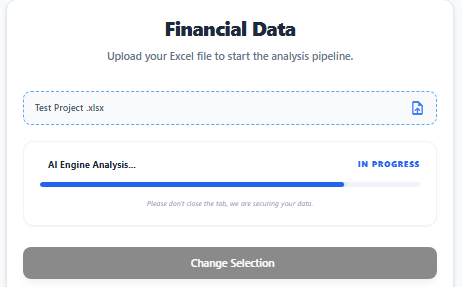
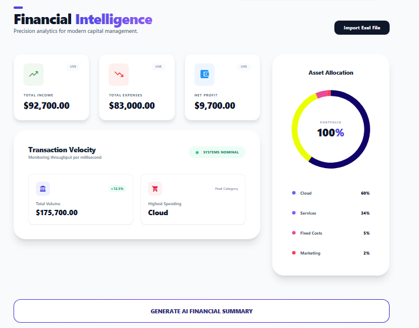
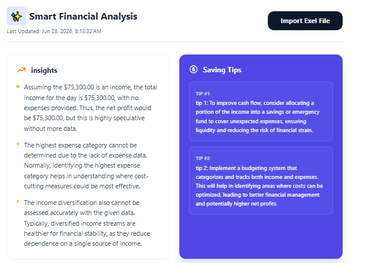

[](https://github.com/Omaremad763/AI-Analytics/actions)
[](https://github.com/Omaremad763/AI-Analytics)
[](https://github.com/Omaremad763/AI-Analytics)
[](https://github.com/Omaremad763/AI-Analytics)
[](https://github.com/Omaremad763/AI-Analytics)
[](https://github.com/Omaremad763/AI-Analytics)
[](https://github.com/Omaremad763/AI-Analytics)
[](https://github.com/Omaremad763/AI-Analytics)


[](https://github.com/Omaremad763/AI-Analytics/blob/main/LICENSE)

# 📊 AI Analytics Platform

> AI-powered Data Analytics System for processing financial Excel/CSV files, generating insights, and visualizing results through an interactive dashboard.

---

# 🚀 Overview

AI Analytics Platform is a full-stack system designed to:

* Upload and process financial datasets (Excel / CSV)
* Parse and store structured financial records
* Generate analytics and KPIs
* Produce AI-generated summaries per dataset batch
* Visualize insights via an interactive dashboard

The system is built using **Clean Architecture + CQRS + Background Processing**.

---

# 🧱 System Architecture

```text
Presentation Layer (ASP.NET Core API)
        │
Application Layer (CQRS + Services + DTOs)
        │
Domain Layer (Entities + Business Rules)
        │
Infrastructure Layer (DB + External Services + File Processing)
```

---

# 📁 Project Structure

```text
AI_Analytics.sln
│
├── Presentation
│   ├── Controllers
│   ├── Middleware
│   └── Program.cs
│
├── Application
│   ├── CQRS
│   ├── DTOs
│   ├── Contracts
│   └── AutoMapper
│
├── Domain
│   ├── Entities
│   └── Enums
│
├── Infrastructure
│   ├── Persistence (EF Core)
│   ├── Services
│   ├── Repositories
│   ├── Migrations
│   └── Excel Parser
│
├── Front (Angular)
│   ├── Pages
│   ├── Core
│   ├── Shared
│   └── Services
│
├── AnalyticsTestProject
└── docker-compose.yml
```
# 🖼️ Screenshots
## Upload Excel file 



---

## Dashboard



---

## Ainsights



---

# 🎥 Demo

Coming Soon...
---

# ⚙️ Core Modules

## 📥 1. Data Ingestion Module

### Purpose

Handles file upload and background processing of datasets.

### Backend Components

* `DataBatch` Entity → tracks uploaded file state
* `IDataBatchRepository`
* `UploadFileCommand`
* `ProcessFileCommand`
* `ExcelParserService`
* Background processing (Hangfire Job)

### API Endpoints

```
POST /api/uploads/upload
GET  /api/uploads/status/{id}
```

### Flow

```text
Upload File → Create Batch → Background Parsing → Store Financial Records → Update Status
```

---

## 📊 2. Analytics Module

### Purpose

Transforms raw financial data into structured metrics and charts.

### Domain

* `FinancialRecord`

### Application Layer

* `GetFinancialMetricsQuery`
* `GetTrendDataQuery`
* `GetCategoryDistributionQuery`

### DTOs

* `MetricCardDto`
* `ChartDataDto`

### API Endpoints

```
GET /api/analytics/metrics
GET /api/analytics/charts
```

### Output Types

* KPI Cards
* Line Chart (Trends)
* Pie Chart (Distribution)

---

## 🤖 3. AI Insights Module

### Purpose

Generates AI-powered summaries per uploaded dataset batch.

### Domain

* `BatchSummary`

### Application Layer

* `GenerateAiSummaryCommand`
* `GetBatchSummaryQuery`

### Infrastructure

* `OpenAIService` (API Wrapper)

### API Endpoint

```
GET /api/analytics/ai-summary/{batchId}
```

### Output

* Natural language financial summary
* Batch-level insights

---

# 🖥️ Frontend (Angular)

## Pages

* Upload File Page
* Analytics Dashboard
* AI Summary Page

## Components

* `FileUploadComponent`
* `StatsCardComponent`
* `ChartWrapperComponent`
* `AiSummaryCardComponent`

## Behavior Flow

```text
Upload File → Receive BatchId → Polling Status → Load Dashboard → Render Charts → Fetch AI Summary
```

---

# 🧠 Domain Model

## Entities

* `DataBatch`

  * FileName
  * Status
  * UploadDate

* `FinancialRecord`

  * Parsed dataset rows

* `BatchSummary`

  * AI-generated summary text

## Enums

* `BatchStatusEnum`
* `FinancialRecordsEnum`

---

# 🔄 Data Flow

```text
1. User uploads file (Excel/CSV)
2. API creates DataBatch
3. Background job parses file
4. FinancialRecords stored in DB
5. Analytics queries aggregate data
6. AI service generates summary
7. Frontend displays:
   - KPIs
   - Charts
   - AI Insights
```

---

# 🐳 Deployment

## Docker Setup

* ASP.NET Core API
* Angular Frontend
* Database (via Docker Compose)

```bash
docker-compose up --build
```

---

# ⚙️ Infrastructure

* EF Core (Database Layer)
* Hangfire (Background Jobs)
* AutoMapper (DTO Mapping)
* OpenAI API Integration
* SQL Views (Analytics Optimization)

---

# 🧪 Testing

* AnalyticsTestProject included
* CQRS unit testing (Data ingestion flow)

---

# 🚀 Key Design Decisions

* CQRS used for separation of reads/writes
* Background jobs for file processing
* Batch-based processing model
* Analytics optimized via SQL Views / aggregation layer
* Modular service contracts for scalability
* AI layer decoupled from analytics engine

---

# 📌 Future Improvements

* Real-time updates (SignalR)
* Advanced AI predictions
* Streaming ingestion pipeline
* Multi-tenant support
* Role-based authentication
* Export reports (PDF / Excel)
* Performance optimization with caching layer

---

# 📄 License

MIT License

---

# 👨‍💻 Author

**Omar Emad**

Software Engineer | Full Stack Development

[](https://www.linkedin.com/in/omar-abusaif/)
> https://www.linkedin.com/in/omar-abusaif/

Online Resume

> (https://omar-emad.vercel.app
### 📈 GitHub Stats


